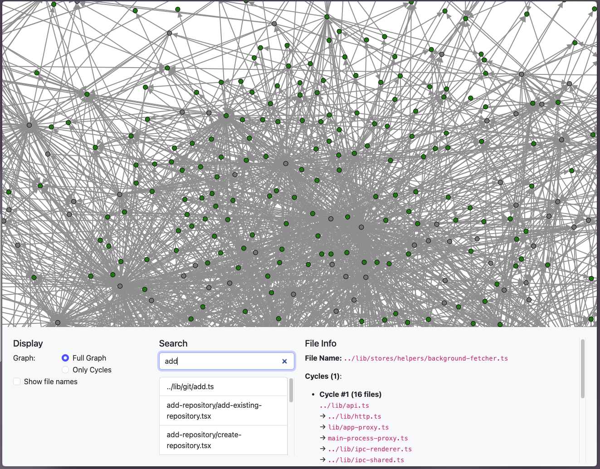

# Edge

A tool that use [madge](https://github.com/pahen/madge) to generate a circular
dependency graph of your codebase.

 _Github Desktop codebase when visualised with Edge_

## How to use

1. Clone to this repo
2. Have [Deno](https://deno.com/) installed.
3. Run `deno run bin/cli.ts <path_to_your_code_base> --html`
4. Hit `A` several times to allow deno system access.
5. The result should be in `edge_analysis.html` file.

## TODO

- [ ] Make this a CLI runnable with `npx`
- [ ] Make output file configurable.
- [ ] Make Edge "core" a library.
